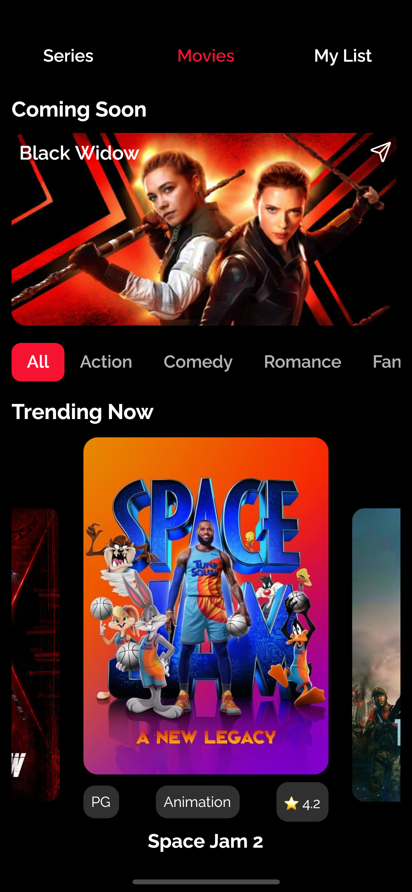
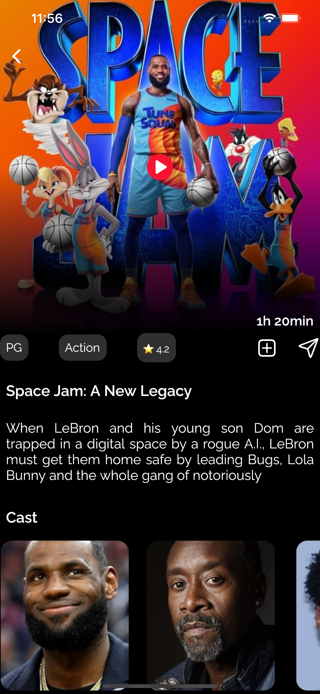

# Flutter MovieApp

Flutter UI implementation.

Will implement real data later

## UI reference by [Joe_nkll](https://dribbble.com/Joe_kl)

## Screenshots

<table>
  <tr>
    <td>
      
    </td>
    <td>
      
    </td>
  </tr>
</table>

